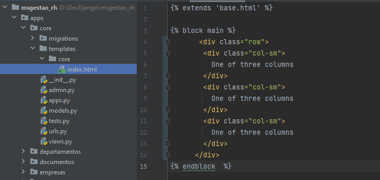
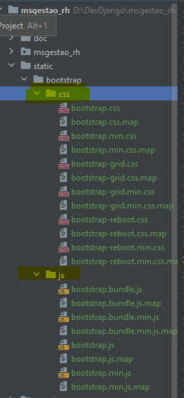
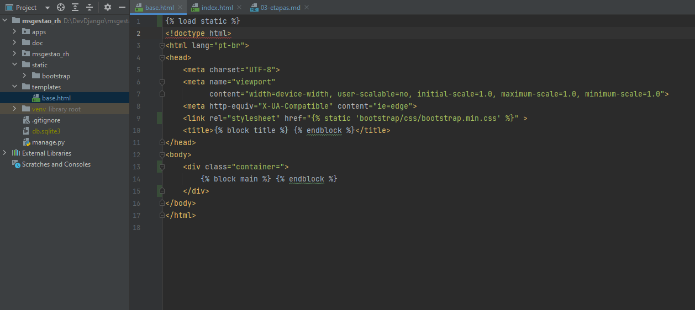

1-Criando o app empresa

Na raiz do projeto, vamos criar um pakage python, chamado "apps"

Ativar a virual env, como estamos no terminal gitbash, deve ser ativado assim:
`
msena@DESKTOP-NU65P6S MINGW64 /d/DevDjango/msgestao_rh (master)
````
. venv/Scripts/activate
````

output
````
(venv) 
````


### Listando todos comandos disponiveis pelomanage.py
````
 python manage.py
````
Output 
````
Type 'manage.py help <subcommand>' for help on a specific subcommand.

Available subcommands:

[auth]
    changepassword
    createsuperuser

[contenttypes]
    remove_stale_contenttypes

[django]
    check
    compilemessages
    createcachetable
    dbshell
    diffsettings
    dumpdata
    flush
    inspectdb
    loaddata
    makemessages
    makemigrations
    migrate
    optimizemigration
    sendtestemail
    shell
    showmigrations
    sqlflush
    sqlmigrate
    sqlsequencereset
    squashmigrations
    startapp
    startproject
    test
    testserver

[sessions]
    clearsessions

[staticfiles]
    collectstatic
    findstatic
    runserver
(venv) 
````


### 1-Criando o app empresas
(venv) D:\dev\msgestaorh>
````
    python manage.py startapp empresas
````

Dica: Será criado uma nova pasta chamada empresas, com a estrutura de arquivos 
do app.

#### Obs:
     Mova a pasta empresas para pasta apps 

### 2-Registrar o app empresa no settings.py
INSTALLED_APPS = [
    'django.contrib.admin',
    ....
    'apps.empresas',
]

Criar o model Empresa no arquivo empresa\models.py
from django.db import models


class Empresa(models.Model):
    nome = models.CharField("help_text=Nome da Empresa",
                            max_length=100, blank=False)
Rodar o makemigrations
(venv) D:\dev\msgestaorh>


## Incluindo o bootstrat

Criamos um ***app core*** que terá o objetivo de ser a primeira app centralizadora do nosso
sistema.
Dentro dela iremos criar as pastas templates\core.Dentro dele o arquivo index.html

A estrutura ficará assim:


Faz o download do bootstrap, cria uma pasta chamada static na raiz do projeto, dentro cria    
outra pasta chamada bootstrap, só pra organizar.

Após descompactar o arquivo de download do bootstrap e move as pasta ***js e css*** para 
dentro da nova pasta bootstrap.



Ela servirá de base para a aplicação inteira.

Agora precisamos inserir esse CCS dentro do nosso template base

Então a gente precisa primeiramente carregar os arquivos estáticos a primeiríssima linha.


Em nosso arquivo base.html vamos inserir o load static e a linha para acessar nosso arquivo css.
Ficará assim:

Arquivo apps/templates/base.html 



Precisamos informar ao django onde deve procurar os arquivos estáticos em nosso sistema.Para isso incluiremos as "constantes" abaixo:

### settings.py
````
...
STATIC_URL = 'static/'

# local onde ficam os arquivos css,js
STATICFILES_DIRS = [
    os.path.join(BASE_DIR, "static"),
]
...
````

