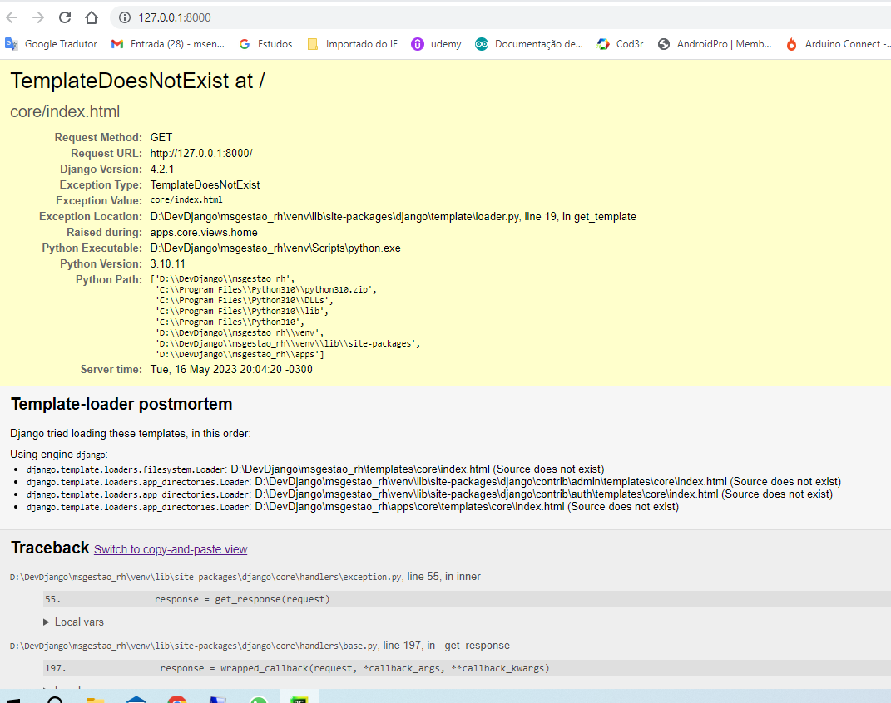
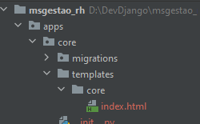
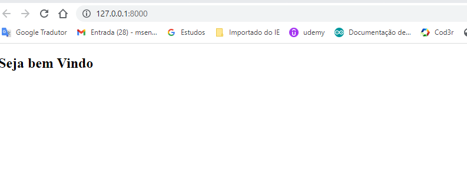

###
Em um determinado momento começou um erro informando que os apps não estavam registrados no settingd.

Solução: Alterar o arquivo : apps.py de cada applicação e acessentar no name o prefixo "apps"
então ficaram assim  ( name = 'apps.funcionarios' )

Exemplo completo do funcionarios/apps.py
 ````
from django.apps import AppConfig
class FuncionariosConfig(AppConfig):
    default_auto_field = 'django.db.models.BigAutoField'
    name = 'apps.funcionarios'
 ````

#### Ao criar o index.html que será a página principal padrão do sistema (na pasta core). 
#### o sistema deveria chamar a página index que está no core,no entanto,  
#### deu o erro seginte 


## Solução criar nova pasta core embaixo de "apps/core/templates/core/index.html"


## Resultado


